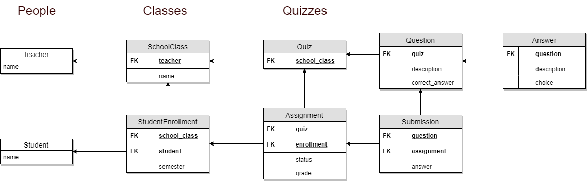

# TDD with Django Rest Framework

Example showing the right way to test a rest API with unit and integration tests. 
We're not using selenium for E2E tests because we should extend this application with a front end to do so.
We're gonna use a school system for this.

I chose to go with a rest API due reusability and scaling.

>*Building RESTful web services, like other programming skills is **part art, part science**. As the Internet industry progresses, creating a REST API becomes more concrete with emerging best practices.*
> -- <cite>**Todd Fredrich, REST API Expert**</cite>

## Summary

- Specifications
    - [Assumptions](#assumptions)
    - [Extended Assumptions](#extended-assumptions-for-our-api)
- Techniques
    - [TDD approach](#tdd-approach)
    - [Refactoring](#refactoring)
    - [Mocking & Integration tests](#mocking--integration-tests)
- Code
    - [Modules](#modules)
    - [Models](#models)
    - [API](#api)

---

# Assumptions

- There are **Teachers**.
- There are **Students**.
- **Students** are in **classes** that **teachers** teach.
- **Teachers** can **assign quizzes** to **students**.
- **Students** solve/answer **questions** to complete the **quiz**, but they don't have to complete it at once. (Partial **submissions** can be made).
- **Quizzes** need to get **graded**.
- For each **teacher**, they can calculate each student's total grade accumulated over a **semester** for their **classes**.

# Extended Assumptions for our API

- We can manage (add, delete, update, retrieve, list) teachers and students
- Quizzes can have as much questions as desired
- All questions should have exactly 4 options
- Questions can repeat
- Answers can't be duplicated (whether by choice or description)
- API will only exposes endpoint to quizzes - questions and choices should be handled through it (like [DDD's aggregate root](https://stackoverflow.com/questions/1958621/whats-an-aggregate-root))
- Users cannot edit submissions nor submit same question twice
- Assignments are automatically graded when all submissions are done
- Grade is calculated by just summing correct answers
- Semester is just a date referencing the start of it

# TDD approach

If we get code now, you will notice lots of mixins, and beautiful code. But if you check commit history from start and keep going until end, then you'll note gently changes over time - transforming bad WET code into neat code.

From migrations to services and handlers, they were only added when requested for the task. So we avoided over-engineering and sticked to deliver the most simple and attending software as fast as possible (done in 2 days of work).

Basically we followed a recipe:

- Add failing tests for URLs (how api will handle it)
- Implement it
- Add failing tests for Serializer (how data should be handled)
- Implement it (Migrations were added here)
- Add failing integration tests for API (how api should behave when requests are made)
- Refactor it

# Refactoring

For refactor is tempting to try to make the **right software right away**, but to avoid over-engineering we sticked to make things work, and at the end of each TDD cycle we started to make things neat. 

Things like:
- Remove duplicated code ([DRY principle](https://en.wikipedia.org/wiki/Don%27t_repeat_yourself))
- Move functions/classes to where they should belong ([Single Responsibility principle](https://en.wikipedia.org/wiki/Single_responsibility_principle))
- Make code simpler ([KISS principle](https://en.wikipedia.org/wiki/KISS_principle))
- Others

# Mocking & Integration tests

It was only mocked things that felt like it should. Django provides a very helpful testing database, so if we can generate great software with amazing tests using it, why not? 

Some people calls it integration (since it handle database), but that's a ideological topic, at the end of the day you still have **fast** (some secs) **unit** (testing just a single part) **tests**.

So, for this I'll consider as integration basically any API, signals, and some services tests

# Modules

We basically have 3 modules (or django apps).

| Module | Description |
|---|---|
| People | Manages Student and Teacher 
| Classes | Manages classes like which student is coursing which class, and which teacher teaches which class
| Quizzes | Manages quizzes, assignments and grades

# Models

# API

| Endpoint | Resource | Description | Allows |
| --- | --- | --- | --- |
| `students/` | Student | Lists or creates students | *GET, POST*
| `students/:id` | Student | Retrieve, update or delete specified student | *GET, PUT, DELETE*
| `students/:id/classes` | StudentEnrollment | Lists or creates student's classes | *GET, POST*
| `students/:id/assignments` | Assignment | Lists or creates student's assingments | *GET, POST*
| `teachers/` | Teacher | Lists or creates teachers | *GET, POST*
| `teachers/:id` | Teacher | Retrieve, update or delete specified teacher | *GET, PUT, DELETE*
| `classes/` | SchoolClass | Lists or creates classes | *GET, POST*
| `classes/:id` | SchoolClass | Retrieve, update or delete specified class | *GET, PUT, DELETE*
| `quizzes/` | Quiz | Lists or creates quizzes | *GET, POST*
| `quizzes/:id` | Quiz | Retrieves specified quiz | *GET*
| `assignments/` | Assignment | Lists assignments | *GET*
| `assignments/:id` | Assignment | Retrieves assignment | *GET*
| `assignments/:id/submissions` | Submission | Lists or creates submissions for specified assignment | *GET, POST*
| `assignments/reports/student-grades?teacher=:id&semester=:date` | *Report* | Retrieves report for teacher's class on specified semester. **Query params are required**. | *GET*